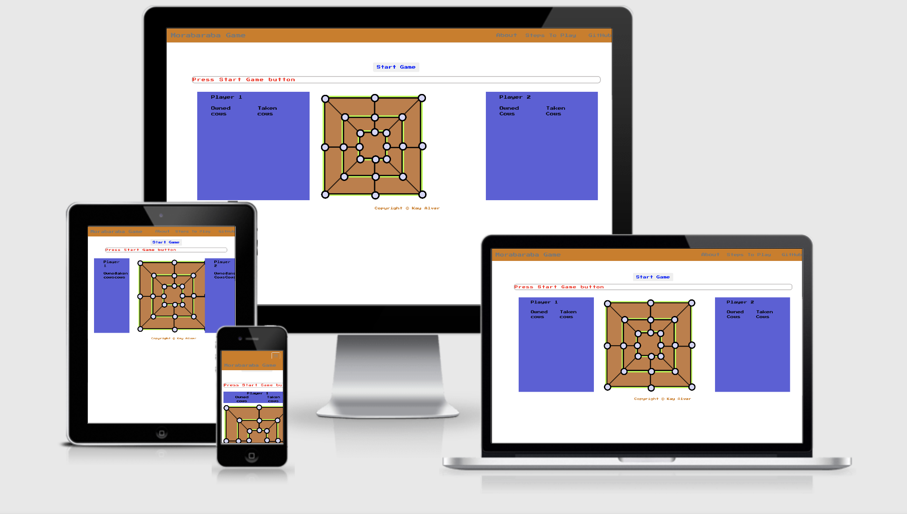

<h1 align="center">Morabaraba Game</h1>

## Code Institute: Milestone Project 2

Most commonly played in Southern Africa especially in Botswana, South Africa and Lesotho,
Morabaraba is a traditional two-player strategy board game.It is reported that Morabaraba boards carved in rock are dated to be at least 800 years old, therefore indicating a non-European origin. Originally played by headman when heading countries. It was used in the community as a way to mend and encourage peace and friendship among people. Allowing them to talk freely, take out anger and share happiness. Indeed it is a talking game. [Check this facebook page](https://www.facebook.com/Mhele-Productions-109539297412881/videos)

It has some similarities to the Twelve Men's Morris, a variation on the Roman board game Nine Men's Morris. In this European game, the counters are most commonly referred to as men (mills), but in the South African game the counters are referred to as cows, the game being particularly popular amongst youth especially young men and those herding cattle.The Oxford English Dictionary, translate that the term "Morabaraba" is derived from the Southern Sotho "moraba-raba", meaning "mill" or to "go round in a circle". [Morabaraba wiki](https://commons.wikimedia.org/wiki/File:Morabaraba_board.svg)

This project is the second one, out of four Milestone Projects in the Full Stack Web Development Program I am attending at The Code Institute. The main requirements is to
build an interactive front-end site which responds to the users' actions using HTML, CSS, JavaScript and JQuery.

[Check this video](https://www.facebook.com/plugins/video.php?height=308&href=https%3A%2F%2Fwww.facebook.com%2F109539297412881%2Fvideos%2F621843702086483%2F&show_text=false&width=560" width="560" height="308" style="border:none;overflow:hidden" scrolling="no" frameborder="0" allowTransparency="true" allow="encrypted-media" allowFullScreen="true)

<iframe src="https://www.facebook.com/plugins/video.php?height=308&href=https%3A%2F%2Fwww.facebook.com%2F109539297412881%2Fvideos%2F621843702086483%2F&show_text=false&width=560" width="560" height="308" style="border:none;overflow:hidden" scrolling="no" frameborder="0" allowTransparency="true" allow="encrypted-media" allowFullScreen="true"></iframe>

**Disclaimer:** The Morabaraba Game is developed for educational purposes only.

**[View project Github repository here.](https://github.com/Kayalvaer/ms-project2.git)**
**[View live project here.](http://kayalvaer.no/New-MS2/index.html)**

---

## Table of Contents

- <a href="#design-Process">1. Design Process (UX)</a>
  - <a href="#ux-goals">1.1. Project goals</a>
  - <a href="#ux-stories">1.2 User stories</a>
  - <a href="#ux-design">1.3 Design</a>
  - <a href="#ux-wireframes">1.4 Wireframes</a>
- <a href="#features">2. Features</a>
  - <a href="#features-existing">2.1 Existing features</a>
  - <a href="#features-future">2.2 Features left to implement in the future</a>
- <a href="#technologies">3. Technologies used</a>
- <a href="#testing">4. Testing</a>
- <a href="#deployment">5. Deployment</a>
- <a href="#credits">6. Credits</a>

<h1>1. Design Process (UX)</h1>

### 1.1 Project goals

- The goal of this project is the design an interactive front-end site. The site should consider the design principles in order to achieve a desired user experience for the targeted personas. This will take into consideration the typography, the color choice to match the target users and incorporate the african headman experience. The choice of sound as well was strategically selected to match the theme of the game.A game as developer i personally relate to and it is not yet popular among developers.
- Creating a game that is easy to understand and play through use of alert messages and giving steps on how to play Morabaraba game.

### 1.2 User stories

_**Developer**_

1. As the developer, I want the users to enjoy and like playing the game, So that the game becomes popular.
2. As the developer, I want the website to show my ability to code in HTML and CSS and use of javascript, So I can achieve a positive user experience for the site visitors.
3. As the developer, I want the game to function well and load connecting plugin, So that users can connect with its history.
4. As a developer, I want the game to be played on all devices and internet browser.

_**Site users**_

**As a player I want:**

1. As a user, I want to easily understand how to play the game.
2. As a user, I want to enjoy playing the game so that i can recommend it to others.
3. As a user, I want to know the history of the game, So that i can relate to its originality.
4. As a user, I want to be able to access the steps of the game.
5. As user, I want the game to be interactive game, so that I can challenge myself to be a winner.
6. As a user, I want to be able to play the game many times as i wish.
7. As a user, I want to the music when playing the game, So that I can relate to it.
8. As a user, I want the game to load fast and not lag so I am not discouraged from playing the game.
9. As a site user, I want to receive alerts when I play the game so I know what I have to do next.
10. As a user, I want to receive alerts when I play the game incorrectly so I know that i made a wrong move.
11. As a user, I want the game website to be easy to navigate so I can find the game and the instructions quickly.
12. As a user, I want clear instructions/steps on how to play the game, so I can start playing quickly.
13. As a user, I want to be notified who wins the game, so that there is no confusion.

### 1.3 Design

#### Project scope

After researching the main goals of this project, Inspirational games similar to my project were searched online. My search started with looking for morabaraba games coded before and I found only two listed below, and both of them used a picture of an existing canvas or play board. The goal was to develop my own canvas with html and css. This was a challenge, however i managed to code it. Coding the diagonals were a bit complicated and i had to google online for tips inspiration in similar website games that already existed. I found these previous tic tac helpful, and the nine men´s mill game particularly useful like one below, as they gave me a realistic idea how i could code my project with a similar skill set:

- [Morabaraba Game by Lusani Masindi](https://www.youtube.com/watch?v=wRy2F_bOBqo&list=PL-1M9V7JEcXwdnu7_FEzxnaObSrXRSp12&index=20)
- [morabaraba by Kurt Rohlandt](https://github.com/qtotuan/mill-boardgame)
- [mill-boardgame by Procchio6 & qtotuan](https://github.com/qtotuan/mill-boardgame)
- [ThreeMensMorris by Rangavendra Raghavcreddy](https://github.com/raghavcreddy/ThreeMensMorris/blob/master/bootstrap-theme.min.css)

After making my research the scope of the project was broken down into must haves and nice to haves.

_**"Must-haves"**_

1. The game must achieve a positive user experience
2. The game must be appealing to the personas.
3. The game must load fast.
4. The game must have steps on how to play.
5. The game my engage with the users,vice-versa.
6. The game my track the users moves.
7. The game must notify users if they win or lose.
8. The game must give users the feeling of african origin related to the game.

_**"Nice-to-haves"**_

1. The game could have tokens available and won displayed instead of counts.
2. The game could allow user to input their name.
3. The user could choose to play against the computer or a second player.
4. The alerts to have a controlled blink styling.

- #### Structure Plane

Simplicity was the aim here, due to timeline. Four navigation list items were added, which were: "Logo Name" to name the game, "About" to tell about the game history, "Steps to play" to help the user with playing morabaraba and "Github" link to access my code for the game.

- #### Colour scheme
  The colours that are used for the start and game over screen are:
-  #ffab0d (Orange)
-  #ffffff (White)
-  #383737 (Dark grey)
-  #ffffff (White)
-  #ffffff (White)
-  #ffffff (White)

#Color palette designed on [Xd color palette](https://xd.adobe.com/view/2f4f2ab7-d326-408a-a4e4-15ff93b99f26-7a1c/)
[Portfolio website](assets/imgs/figma-color palette.png)

The color choice of this project was putting into consideration the history and motive of the gave. The light blue color to represent friendship, nature and rustic color to represent the sand which most of the "cowboys" had to draw the game on the sand and use bottle cans or stones found in the forest. Though if possible one can use a flat box or board, sketch the lines with black burned wood remains.

- #### Fonts

  The **press to start 2p** font has been used throughout the whole game. Sans Serif is the fallback in case the main font isn’t being imported to the site correctly. The press to start 2p fonts is used for the whole game including the title.

- #### Audio

  The sounds of the project has been inspired by the history of the game, coming for the southern african countries originally. My personal experience of the game in Africa when i was young and the culture related to it.All sounds that are used for the project are from Code [Zapsplat.com](https://www.zapsplat.com/sound-effect-category/drums-and-percussion/).

  

### 1.4 Wireframes

Paper wireframes and Mockup on figma was designed for the project. Most of the work was done on paper because of the strategic placing of the board nodes which were challenging.The mockups were designed with [Figma](https://www.figma.com/proto/JByjPwrRtqQ5uZejpJUT8h/Untitled?node-id=3%3A0&scaling=min-zoom)

The wireframes were as follows:

**Note:** I changed the layout of game by displaying the result numbers instead of the tokens. It can be included in the future expansion of the project.

<h1>2. Features</h1>

### 2.1 Existing features

#### 1. Menu

- Steps on how to play Morabaraba is included.
- History about the game is included.
- Github repository link to access my code is available in the menu.

#### 2. Start Game

- The start button controls the on and off of the game.

#### 3. Play Game

- One player place token on the board on turns.
- Pop up messages with remind players on whose turn it is.
- Users place the tokens on the nodes provided on the board.
- Users can move on the lines visible.
- Having the same three tokens on row, three columns and three diagonals achieve a point.
- A player who cannot move or is left with two tokens lose the game.

#### 4. Responsive HTML Board

- The board of the game was made to be responsive on all devices, however some of the devices where challenging to keep the board fixed without losing its original aspect ratio.

#### 5. Points

- Scores and remaining tokens are visible on the board side.
- The winning player gets notified by a pop up message.

#### 6. Audio

- During the game, the three sounds interact with the game:
  - A sound is made when the player start the game.
  - A background marimba and drum sound plays till the end on and off.
  - A cow moo sound plays when a player get a point by picking an opponent's cows.

#### Game End

- When the game is over the game will give a pop up message to press start if u want to play again.

### 2.2 Future Features to implement

- **Option to play with computer:** Allowing the user to play with a computer can be a future feature to add.
- **Choosing the avatar of the game** Allowing the user to choose an avatar can be a great engaging feature.
- **Choosing own name** Allowing the user to choose own name is a personality feature.
- **Happy audio for the winner** Nice african themed marimba short video can be a nice feature maybe giving the winner a choice of five marimba songs to celebrate.

#### More Nice to have Features

Developing the game further, I could add the following features:

- Make it possible for users to invite friends to play with them.
- Social media sharing possibility.
- Functionality to allow users to play with their keyboards.
- Functionality to chat while playing.

<h1>3. Technologies used</h1>

#### Languages used

- [HTML5](https://en.wikipedia.org/wiki/HTML5)
  - HTML5 provides the structure and the content for my project.
- [CSS3](https://en.wikipedia.org/wiki/Cascading_Style_Sheets)
  - CSS3 provides the style of the HTML5 elements.
- [Javascript](https://en.wikipedia.org/wiki/JavaScript)
  - JavaScript provides the interactivity of the project.

#### Frameworks, libraries & programs used

- [vsCode](https://code.visualstudio.com/)
  - The vscode is used to code and develop the project.
- [Git](https://git-scm.com/)
  - The Git was used for version control to commit to Git and push to GitHub.
- [GitHub](https://github.com/)
  - The GitHub is used to host the project.
- [Google Fonts](https://fonts.google.com/)
  - Google Fonts is used to provide the font roboto for all the text that is used in the project.

#### Testing tools used

- [Autoprefixer](https://autoprefixer.github.io/)
  - Autoprefixer is used to parsethe CSS and to add vendor prefixes to CSS rules.
- [W3C Markup Validation Service](https://validator.w3.org/)
  - The W3C MarkUp Validation Service is used to check whether errors in the HTML5 code.
- [W3C CSS validator](https://jigsaw.w3.org/css-validator/)
  - The W3C CSS validator is used to check errors in the CSS3 code.
- [JShint](https://jshint.com/)
  - JShint is a JavaScript validator is used to check any errors in the JavaScript code.

#### More Tools

- [Figma](https://www.figma.com/)
  - Figma is used to create the mockup designs for the project.
- [Tinypng](https://tinypng.com/)
  - The vscode is used to code and develop the project.
- [Zapsplat](https://zapsplat.com/)
  - The vscode is used to code and develop the project.
- [Fontawesome](https://fontawesome.com/)
  - The Git was used for version control to commit to Git and push to GitHub.
- [Google Developer Tools](https://google.com/)
  - The GitHub is used to host the project.

## Git Commit Messages

Commit were done regularly and messages were short and clear.

<h1>4. Testing</h1>

## Testing During Development

Much of the testing my JavaScript code was done throughout the development process using `console.log` within each function to report on what variables and arrays were being generated at each stage of the game. Read the output and used breakpoint to check the location of my nodes and the movement action as i manually tested them. that allowed me to fix any code error on the process.

## Code Validation

### HTML

Used the W3C Markup Validation Service to test the validity of my HTML as I go and some errors were sorted.

### CSS

I used the W3C CSS Validation Service to test the validity of my CSS. It didn't flag any issues.

### JavaScript and JQuery

I used JSHint to test the validity of my JavaScript and JQuery.

### Responsiveness

Google Developer tools was used to test the layout of my site on multiple device sizes, and also shared the deployed site with family and friends for them to test on their devices too.

### Performance

Lighthouse tool on the Google Developer software was useful to test the performance of my game. It flagged several errors which some were resolved.

<h1>5. Deployment</h1>

#### Deployment of my project

This project is hosted in GitHub pages, to make my project visible to others.

The project is deployed via the following steps:

1. Log in to GitHub and go to the repository.
2. At the top of the repository, locate the **Settings** button and click on it.
3. On the Settings page, scroll down to the **GitHub Pages** section.
4. Select **Master Branche** by the source section.
5. The page refreshes automatically.
6. Scroll down to the GitHub Page section and the link of the website is standing in the green bar.

#### Clone my project

To make a local clone and deploy this project in your GitHub Desktop, follow the following steps.

To clone this project from GitHub:

1. Log in to GitHub and go to the repository.
2. Click on the green button with the text **“Code”.**
3. Click on **“Open with GitHub Desktop”** and follow the prompts in the GitHub Desktop Application or follow the instructions from **[this link](https://docs.github.com/en/free-pro-team@latest/github/creating-cloning-and-archiving-repositories/cloning-a-repository#cloning-a-repository-to-github-desktop)** to see how to clone the repository in other ways.

<h1>6. Credits</h1>

#### Content

- All text in this project is original content.
- The developer took inspiration from several tutorials and other resources.

**Other resources**

- [W3Schools: HTML Audio/Video DOM volume Property](https://www.w3schools.com/jsref/tryit.asp?filename=tryjsref_audio_play)
- [W3Schools: Onclick Event](https://www.w3schools.com/jsref/event_onclick.asp)
- [stackoverflow: diagonals](https://stackoverflow.com/questions/18012420/draw-diagonal-lines-in-div-background-with-css)

#### Acknowledgement

A Thank you to the following people or organizations who helped or inspired me for the project.

- The lessons and knowledge of [Code Institute.](https://codeinstitute.net/)
- The a lead on how to make diagonal lines from Tutor Assistance.

## Cloning

To develop my project further you can clone it to your local machine with the following steps:

1. Scroll to the top of my repository and click on the _Clone or download_ button.
2. Decide whether you want to clone the project using HTTPS or an SSH key.
3. For HTTPS: click on the checklist icon to the right of the URL.
4. For SSH key: first click on 'Use SSH' then click on the checklist icon to the right of the URL.
5. Open the _Terminal._
6. Change the current working directory to the destination of the cloned directory.
7. Type "git clone" and then paste the URL you copied earlier.
8. Press _Enter_ to create your local clone.

More information can be found [here](https://docs.github.com/en/enterprise/2.13/user/articles/cloning-a-repository).
